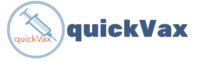
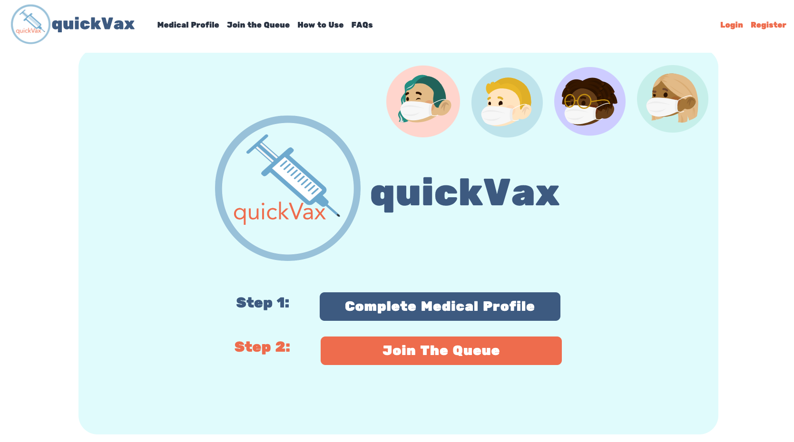
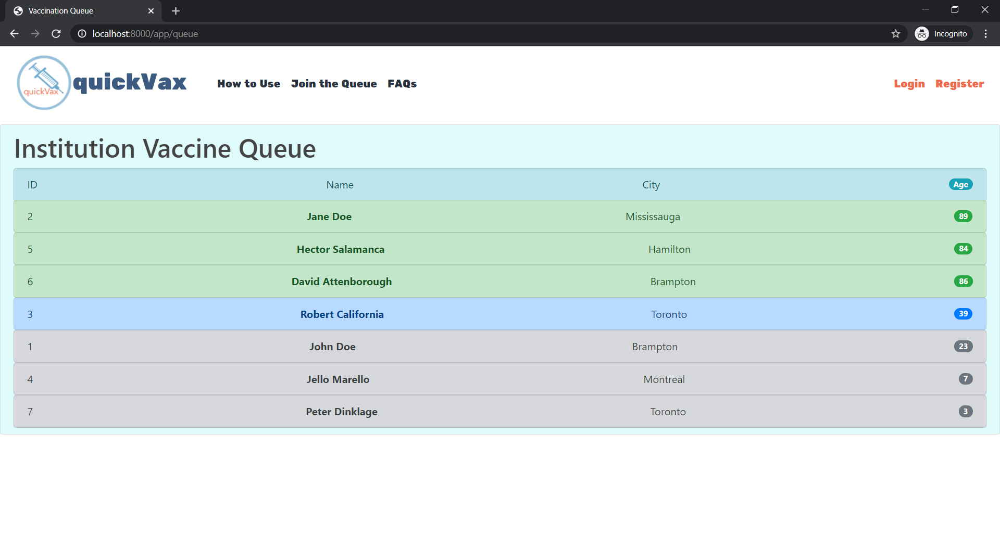
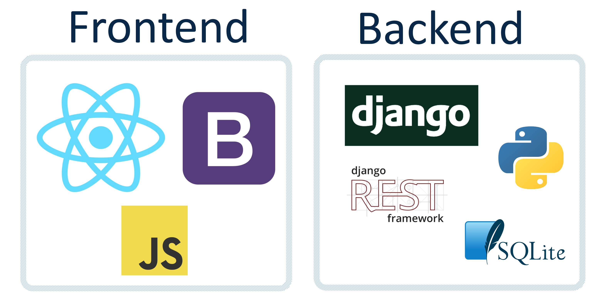

# Hack The North 2020 Submission
## Inspiration
COVID-19 has greatly impacted all of our lives. We have been forced to adapt and be creative with how we are carrying out our daily routines. Even right now, this hackathon has been shifted entirely to an online platform. As we see the roll-out of vaccines, everyone is eager to obtain one. The eligibility and priority list for vaccinations have been released and people are starting to receive the drug. However, these individuals are still forced to wait in person, increasing the risk of contracting the virus. As with everything in the healthcare system, queues are inevitable.  
  
  
*WHO,* (2020). *[Special feature: immunization and COVID-19](https://www.who.int/immunization/monitoring_surveillance/immunization-and-covid-19/en/)
  
## What it does
Introducing ***quickVax!***  
  
Click image below for demo video (or click [here](https://youtu.be/CR-H_pygR2w))  
  
Click [here](http://www.usain-bolt-thought-he-was-quick-until-quickvax-came.online.ngrok.io/) to try the application out!
  
***quickVax*** was created out of the need to eliminate another tiring line up and minimize the strain associated with the COVID-19 pandemic. We realized many individuals waiting to obtain a vaccine can wait hours on end. This is due to poor logistical management and the many forms that must be completed by the patient. With ***quickVax,*** we are streamlining the process to have the necessary documents already gathered as well as minimizing risk by creating a virtual queue. Therefore, those who are at the vaccination facility are purely there to receive a vaccination. No paperwork, just the scan of your unique QR code identifier.  
  
  
  
The website serves both the patient and the institutions in administering vaccines, allowing patients and institutions to register for their separate accounts. After making an account or signing in, users can fill out their medical profile which will include questions required by medical institutions before administering vaccinations. Upon completion of their medical profile, users can press “Join the Queue” to see a map of medical institutions distributing vaccines nearby.  
Medical institutions can then scan their code and retrieve the user’s information. After selecting a location, there will be a final round of questions the user must answer to confirm that they are eligible for vaccinations. After that, the user can wait virtually in line for their location of choice.  
Since our application also has medical institutions users, the institutions can look at their queue of patients. The queue is sorted first by senior citizens, indicated by green, and second by patients with underlying conditions, indicated by blue. This is intended to allow institutions to prioritize their vaccines to be delivered to the ones that need them the most.  

  
  
## How we built it
***quickVax*** is built using **Django** on the backend, and **React.js** and **Bootstrap 4** on the frontend. The database is hosted securely on a **SQLite3** database with the **Django Framework** communicating with the frontend.  
  
  
  
## Challenges we ran into
The most challenging aspect of our application was integrating Django and React.js together. There were plenty of obstacles we had to consider, including efficiency, communication, and secure authentication. Another early obstacle that presented itself was a missing Python dependency for one of our team mate's computer which prevented her from running Django. After a painful process of scanning stack overflow pages, we managed to fix that issue and continue production  
  
**NOTE:** Because of the Python dependency issue, one of our team mates had to use a different device to contribute, and so had to use another github account to commit to the repository. This may show up on the github. Just to be clear, this is NOT a 5th member.
  
## Accomplishments that I'm proud of and what we learned
We are proud to have been able to produce a fully-functioning web application in just 36 hours! For most of us, most of the technologies experimented with were new territories. While we were faced with various obstacles in our way, through perseverance, we conquered them all! We learnt to use various different frameworks and languages, but most of all we learnt how to efficiently work as a team!

## What's next for ***quickVax***
- mobile app implementation where users can take their digital medical profile with them on the go, recieve in-app notifications of their process in the queue and use notifications to ensure that people in the queue are still in line
- migration of database to a secure cloud server
- implementation of a more efficient priority queue system by taking into account the input and output rates of medical institutions